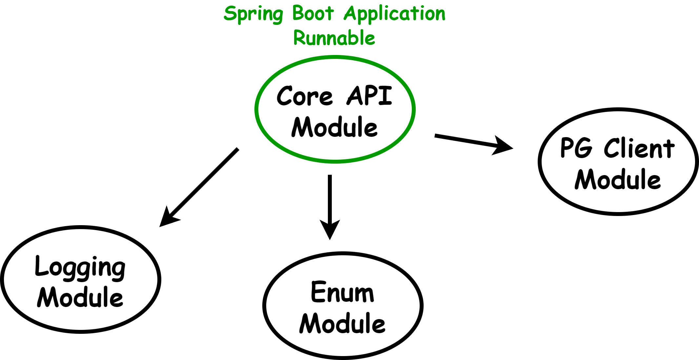

# Ecommerce 토이 프로젝트

## 요구사항 정의
https://www.notion.so/ecommerce-29556c59324f80c880b8e216714ad445?source=copy_link

## 기술 스택
- Java 21, Spring Boot (3.5.X)
- Gradle (Groovy)
- JPA / Hibernate
- MySQL / H2
- Spring REST Docs & JUnit5
- openfeign & circuitbreaker(resilience4j)

## AI Agent 프로젝트 규칙/지침 파일
`ecommerce/AGENTS.md`

## API 문서
- 테스트 대상: `core:core-api` 모듈
- API 문서 생성 경로: `ecommerce/docs/index.html`
- 
## 모듈 구조 (멀티 모듈)

- `core:core-api`
    - 애플리케이션 계층과 프레젠테이션(Web API) 계층을 포함합니다.
    - 주요 내용: Spring MVC Controller, 요청/응답 DTO, 도메인 서비스, 공용 응답/에러/인증 지원 코드.

- `core:core-enum`
    - 프로젝트 전반에서 공통으로 사용하는 열거형 타입 모음 모듈입니다.

- `support:logging`
   - 로깅 관련 공통 설정 모듈입니다. logback 설정 리소스를 포함합니다.

- `clients`
  - 외부 연동/클라이언트 모듈입니다.

- JPA 엔티티 & 레포지토리는 필요한 경우 별도 모듈로 분리 진행

## 의존성 및 빌드 공통 설정
- bootJar는 `core-api` 모듈만 활성화하고, 이 외 모듈은 일반 jar를 생성합니다. 즉, 각 모듈은 라이브러리로 패키징됩니다.
- 테스트 Tasks: `unitTest`, `integrationTest`, `restDocsTest` 태스크 제공 (JUnit5 기반)

## 테스트 실행
- 전체 테스트: `./gradlew test`
- 컨트롤러 테스트(rest docs 문서 생성)만: `./gradlew restDocsTest`
- 단위 테스트만: `./gradlew unitTest`
- 통합 테스트만: `./gradlew integrationTest`

## 레이어 구조 및 컨벤션
- 레이어 구조: Presentation, Business(비지니스 흐름 제어), Implement(비지니스 구현), Data Access의 4계층 분리.
- 참조 규칙: 순방향 참조만 허용하며, 하위 레이어를 건너뛰지 않는다.
- 트랜잭션: Implement Layer에만 `@Transactional`을 사용한다.
- Presentation Layer
  - 컨트롤러: `XxxController`
  - 유스케이스: `XxxUseCase`
    - `@Component` 사용
    - API 스팩에 따른 응답을 생성하기위한 컴포넌트
    - 도메인 별 `XxxService`, `XxxReader` 등을 조합하기 위한 컴포넌트 역할 (필요 시 생성 ex. `ProductDetailUseCase`)
- Business Layer (도메인 비지니스 흐름 제어)
  - 서비스: `XxxService`
  - `@Service` 사용
  - 구현체 컴포넌트를 이용하여 해당 도메인 비지니스 흐름 조율
  - `XxxService`에서의 응답은 엔티티 객체 or 도메인 DTO로 제한
- Implement Layer (도메인 비지니스 로직 구현)
  - 구현체: `XxxWriter`, `XxxReader`, `XxxValidator`, `XxxProcessor` 등
    - `@Component` 사용
    - 도메인 비지니스 로직을 구현을 위한 컴포넌트
    - 같은 도메인의 구현체 컴포넌트끼리는 참조 가능
    - 개념 & 의미가 분산되지 않도록 접미사 팀 컨벤션 필요 (예시)
    - `Writer`: 생명주기 관리
    - `Reader`: 조회 전담
    - `Validator`: 정책 검증
    - `Processor`: 특정 비지니스 흐름 처리
- Data Access Layer
  - `XxxRepository`
---
- 공통 응답 스팩(`ApiResponse`)과 에러 핸들링 정책(`core:core-api/support/error`) 확인
- 엔드포인트: 소문자-하이픈, 복수형 리소스명 사용 (`/v1/cart/items`)
- 엔티티: 단수형 리소스명 사용 (Order, Payment 등)
- API 스팩 DTO: `XxxRequest`, `XxxResponse`
- Data Access Layer 쿼리 응답 매핑 DTO: `XxxView`
- 열거형: 개념 의미가 드러나는 명사형 (`OrderStatus` 등)
